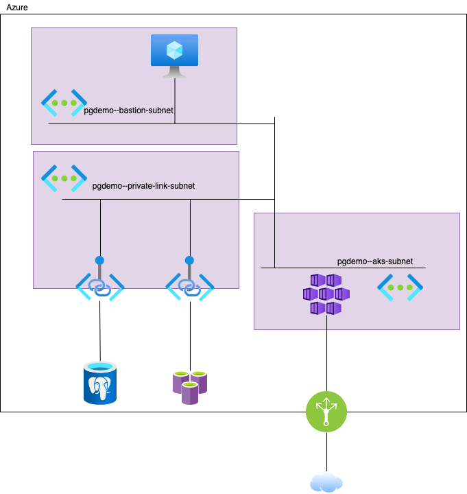

# AKS / Spring-boot + PostgreSQL + Redis cache サンプルアプリケーション

## ディレクトリ構成概要

<pre>
.
├── appinsights-agent
|     Application Insights Dockerイメージ作成
├── azure-setup
│   │   Azureリソース IaC     
│   └── templates
|         Azureリソース作成用 IaCテンプレート
├── bff
|     Backend for Frontend サンプルアプリケーション
├── client
|     負荷生成用サンプルクライアントアプリケーション
├── db-setup
|     serverアプリケーション用テストデータ投入スクリプト
├── deploy
│   ├── bff
|   |     bffサンプルアプリケーションデプロイ用定義ファイル
│   └── server
|         apiサンプルアプリケーションデプロイ用定義ファイル
├── k8s-setup
|     Ingress等共通kubernetesデプロイ定義ファイル
├── server
|     apiサンプルアプリケーション
└── test-environment
      ローカル環境テスト用Doker composeファイル
</pre>

